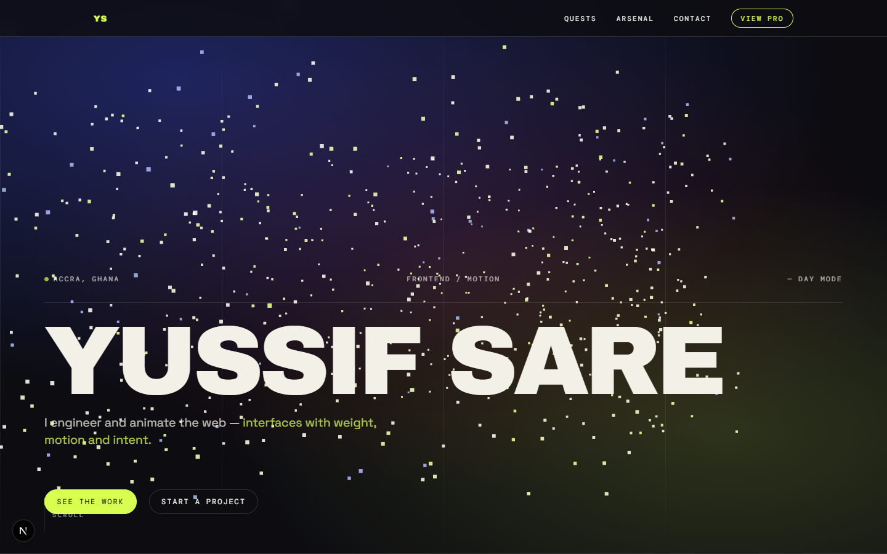

# portfolio

My personal site. Animated homepage for humans, plain `/pro` page for recruiters.

**Live:** [yussifsare.is-a.dev](https://yussifsare.is-a.dev) (fallback: [portfolio on Vercel](https://portfolio-vert-psi-99.vercel.app))



Recruiters in a hurry: [skip to the plain pro page](https://yussifsare.is-a.dev/pro) — same info, zero animation.

## Routes

- `/` — the animated portfolio: boot intro, Three.js hero, about, selected work, arsenal, experience, contact
- `/pro` — same info, zero animation. For fast review.

## Stack

Next.js 16 (App Router) + React 19 + TypeScript. GSAP + ScrollTrigger for scroll motion, anime.js for the boot sequence, Three.js for the desktop hero field, a 2D canvas field + comet trails on mobile. No Tailwind — hand-written CSS with custom properties. GitHub API for live repo stats, static fallback when it fails.

## Run it

```bash
npm install
npm run dev
```

Open http://localhost:3000. Restart the dev server after touching `next.config.ts` — Next only reads it at startup.

Other commands: `npm run build`, `npm run lint`, `npx tsc --noEmit`.

## Notes

- `src/data/github.ts` is the curated work list (order and entries are hand-picked, not auto-pulled).
- `SITE_URL` lives in `src/lib/site.ts` — one line to change if the domain moves.
- Animations respect `prefers-reduced-motion` throughout.
